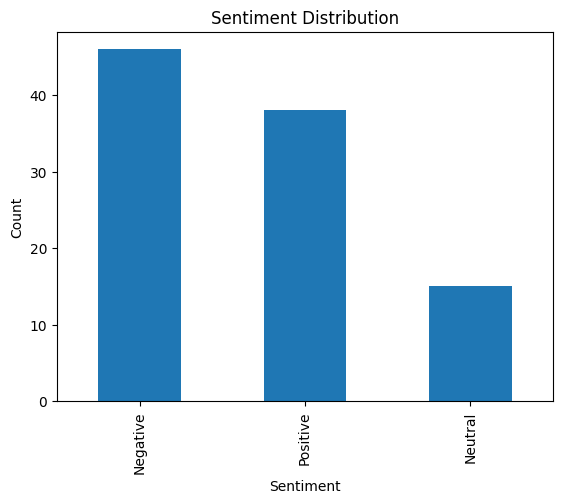
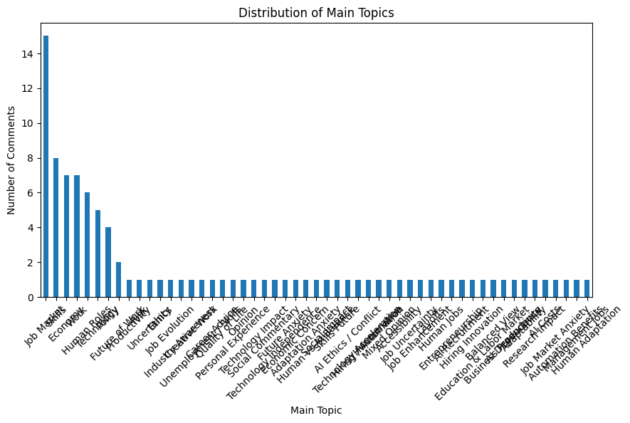

# AI and the Future of Work: Sentiment Analysis of YouTube Comments

## 📊 Project Overview

This project explores public perceptions regarding the impact of Artificial Intelligence on the future of work. A dataset of YouTube comments was collected, manually labeled, and analyzed using Python to perform sentiment analysis and identify key discussion topics.

The main objective is to understand how people feel about AI in the context of employment and societal change, classifying opinions into positive, negative, or neutral sentiments.

---

## 🛠️ Technologies Used

- Python
- Pandas
- Matplotlib
- Google Colab
- GitHub

---

## 📂 Dataset

- **Source:** YouTube comments (manually collected)
- **Total samples:** 99 comments
- **Sentiment labels:**
  - Positive
  - Negative
  - Neutral

---

## 📈 Exploratory Data Analysis (EDA)

The dataset was analyzed to identify sentiment distribution and dominant themes in user opinions.

### Sentiment Distribution
- Negative: 46
- Positive: 38
- Neutral: 15

### Main Topics Identified
- Job Market
- Human Roles
- Skills and Education
- Economy
- Remote Work

---

## 📉 Key Insights

- Negative sentiment was slightly dominant, indicating concerns about job displacement and economic impact caused by AI.
- Positive comments highlighted opportunities for productivity, innovation, and new career paths.
- Neutral responses often focused on descriptive or observational statements without clear emotional bias.

---

## 🧠 Conclusion

The analysis suggests a mixed perception of Artificial Intelligence in the context of work. While many users acknowledge its benefits, there is significant concern about automation, job loss, and inequality.

At the same time, the data highlights a strong belief that human skills—such as creativity, emotional intelligence, and adaptability—will remain essential in the future labor market.

This project demonstrates a complete data analysis workflow, including data collection, manual labeling, exploratory analysis, visualization, and interpretation using Python.

---

## 🚀 Future Improvements

- Apply machine learning models for automated sentiment classification
- Expand dataset for higher statistical reliability
- Perform topic modeling (e.g., LDA)
- Build a dashboard (Streamlit or Power BI)
- Integrate YouTube API for real-time data collection

---

## 📌 Author

Project developed as part of a data analysis and AI learning journey using Python.
# AI and the Future of Work: Sentiment Analysis

## Sentiment Distribution

## Main Topics Distribution

